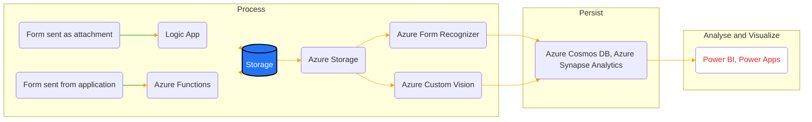

# 03 January 2023

## Plan for today 
- [ ] Bring up the solution described in following link [Automate COVID-19 test forms](https://learn.microsoft.com/en-us/azure/architecture/example-scenario/ai/form-recognizer-covid).
- [x] Complete reading ten pages of each book. 

```mermaid
gantt
    title Timeline
    dateFormat HH:mm
    axisFormat %H:%M
    section Activity
    Plan Azure Solution   :active,  11:00,12:30
    Execute Azure Solution :  12:30, 14:00
    Execute Azure Solution : 15:00, 17:30
    Read Book: 19:00, 21:00
    Read Book: 22:00,23:00
    section Read
    Logic App: 19:00, 20:00
    Git: 20:00,21:00
    Atomic Habit: 22:00,23:00

    section Break
    Lunch: 14:00, 15:00
    Family Time: 17:30,19:00
    Dinner: 21:00, 22:00 
```

## Automate COVID-19 test forms
This is solution sample provided by microsoft for showcasing few of the capabilities.

Today, I just intent to bring up the solution sample solution.
Tomorrow, my plan is to make it so that I can have multiple environment related to development cycle, basically.
- Development,
- Functional Test,
- Integration Test,
- Staging and
- Production.
  
> Note: There is plethora of industrial scenario provided by Microsoft, which is at [link](https://learn.microsoft.com/en-us/azure/architecture/industries/overview)

I read the notes and the dataflow is Azure logic app ingest raw data from email attachment and it will process the raw data and provide it as input to Data Lake storage to process the form and convert to key value json data, which will be stored in Cosmos DB. Finally PowerBI will consume these structured data and is display to customer.

## Read
Plan is to read about logic app, Git and Atomic Habit.

## Distraction
Was distracted to organizing my activity i.e., [this video](https://www.youtube.com/watch?v=ZouUPYH59Uc&t=30). Time spent
Was useful though.

## End of day notes
What did I do for family?
- Played with Kids
- Watched movie with wife 
  

There were few unaccounted instance where I had to go out. One to get medicine and another time, for evening snack.
I fell short on accomplishing one goal which was to get the Azure resource deployed, I am now thinking will look into other better logic app solution which can be deployed.
There were few distractions, which I could have avoided.

Expense that I recall for today,
1. Snacks - 118 Rs
2. Fruits - 262 Rs
3. Medicine - 65
4. Act BB payment - 44

