# 03 January 2023

## Plan for today 
- [ ] Bring up the solution described in following link [Automate COVID-19 test forms](https://learn.microsoft.com/en-us/azure/architecture/example-scenario/ai/form-recognizer-covid).
- [ ] Complete reading ten pages of each book. 

```mermaid
gantt
    title Timeline
    dateFormat HH:mm
    axisFormat %H:%M
    section Activity
    Plan Azure Solution   :active,  11:00,12:30
    Execute Azure Solution :  12:30, 14:00
    Execute Azure Solution : 15:00, 17:30
    Read Book: 19:00, 21:00
    Read Book: 22:00,23:00
    section Read
    Logic App: 19:00, 20:00
    Git: 20:00,21:00
    Atomic Habit: 22:00,23:00

    section Break
    Lunch: 14:00, 15:00
    Family Time: 17:30,19:00
    Dinner: 21:00, 22:00 
```

## Automate COVID-19 test forms
This is solution sample provided by microsoft for showcasing few of the capabilities.

Today, I just intent to bring up the solution sample solution.
Tomorrow, my plan is to make it so that I can have multiple environment related to development cycle, basically.
- Development,
- Functional Test,
- Integration Test,
- Staging and
- Production.
  

## Read
Plan is to read about logic app, Git and Atomic Habit.