# 04 January 2023
- [ ] Go through webinar [link](https://event.on24.com/eventRegistration/console/apollox/mainEvent?simulive=y&eventid=3012221&sessionid=1&username=&partnerref=&format=fhvideo1&mobile=&flashsupportedmobiledevice=&helpcenter=&key=DF262A2570FCE74DDE56098B18A6BD11&newConsole=true&nxChe=true&newTabCon=true&consoleEarEventConsole=false&text_language_id=en&playerwidth=748&playerheight=526&eventuserid=425967263&contenttype=A&mediametricsessionid=500780270&mediametricid=4213653&usercd=425967263&mode=launch)
- [ ] Implement the sample solution in webinar
- [ ] Complete by creating variable for COVID solution
- [ ] Checkout [Link](https://learn.microsoft.com/en-gb/training/azure/?sso=azure-portal&WT.mc_id=home_homepage-azureportal-learn?sso=azure-portal&WT.mc_id=home_homepage-azureportal-learn)

```mermaid
gantt
    title Timeline
    dateFormat HH:mm
    axisFormat %H:%M
    section Activity
    Go through webinar   :  10:00,12:30
    Azure Solution :  12:30, 14:00
    Implement COVID Azure Solution : 15:00, 17:30
    Read Book: 19:00, 21:00
    Read Book: 22:00,23:00
    section Read
    Logic App: 19:00, 20:00
    Git: 20:00,21:00
    Atomic Habit: 22:00,23:00

    section Break
    Breakfast: 08:00, 09:00
    Family Time: 09:00,10:00
    Lunch: 14:00, 15:00
    Family Time: 17:30,19:00
    Dinner: 21:00, 22:00 
```

## Family Time
Plan to take out Aadhya and Aarav out in open ground and teach them to make tiny sticks and create a toy house.
