# 04 January 2023

- [ ] Create Logic App using portal in case not able to create offline.
- [ ] Create logic app for sample scenarios that you can find online.
- [ ] Keep creating as many logic app as you can.

```mermaid
gantt
    title Timeline
    dateFormat HH:mm
    axisFormat %H:%M
    section Activity
    Logic App   :  10:00, 14:00
    Logic App : 15:00, 17:30
    Read Book: 19:00, 21:00
    Read Book: 22:00,23:00
    section Read
    Logic App: 19:00, 20:00
    Git: 20:00,21:00
    Atomic Habit: 22:00,23:00

    section Break
    Breakfast: 08:00, 09:00
    Family Time: 09:00,10:00
    Lunch: 14:00, 15:00
    Family Time: 17:30,19:00
    Dinner: 21:00, 22:00 
```

## Family Time
Spend time with Aarav and Aadhya,
- Teach Aarav how to throw ball.
- Teach Aadhya about recalling things that we learn.

## Webinar
Going through webinar at 10:40AM.

Other videos that are useful are 
- https://www.youtube.com/watch?v=Z3qaBQS0w20
- https://www.youtube.com/watch?v=A74LT0P5hjo
- https://www.youtube.com/watch?v=_V7xfASK-rM

## Issues

### Debugging the logic app standard.
Find a fix for the issue.