# 08 January 2023

- [ ] Complete todo from [07 January 2023](07January2023.md).
- [ ] Start looking into API Management.

```mermaid
gantt
    title Timeline
    dateFormat HH:mm
    axisFormat %H:%M
    section Activity
    Logic App   :  10:00, 14:00
    Logic App : 15:00, 17:30
    Read Book: 19:00, 21:00
    Read Book: 22:00,23:00
    section Read
    Logic App: 19:00, 20:00
    Git: 20:00,21:00
    Atomic Habit: 22:00,23:00

    section Break
    Breakfast: 08:00, 09:00
    Family Time: 09:00,10:00
    Lunch: 14:00, 15:00
    Family Time: 17:30,19:00
    Dinner: 21:00, 22:00 
```

- [ ] Create VMs and configure it to an environment where to develop logic app normally.

Plan is as follows,

Actual is as follows,

```mermaid
gantt
    title Timeline
    dateFormat HH:mm
    axisFormat %H:%M
    section Activity
    Distracted   :a1,10:00, 11:20
    Creating script for VMS: 11:30, 14:00
    Distracted :a2, 15:00, 17:30
    Checkpoint_C1: milestone, after a2
    Read Book: 19:00, 21:00
    Read Book: 22:00,23:00
    section Read
    Logic App: 19:00, 20:00
    Git: 20:00,21:00
    Atomic Habit: 22:00,23:00

    section Break
    Breakfast: 08:00, 09:00
    Family Time: 09:00,10:00
    Lunch: 14:00, 15:00
    Family Time: 17:30,19:00
    Dinner: 21:00, 22:00 
```

## Logic App

- Learn about deployment of local development file to Azure.
- TODO: Look into liquid template and see if you can form a study path.

## Journal  

Started my day at 10:00 AM and watch shorts. I should cut back on watching shorts, they are wasting a lot of time.

### Checkpoints

#### C1

Did not do anything from 12:30 till now, that is 17:04.
Distracted by shorts.
