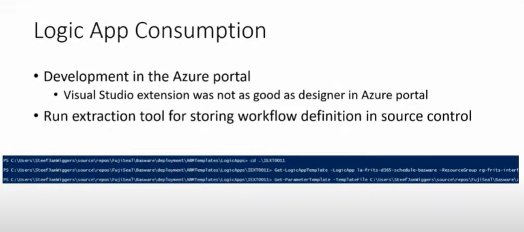

# 09 January 2023

- [09 January 2023](#09-january-2023)
  - [Logic App](#logic-app)
  - [Journel](#journel)
  - [Twitter API Key](#twitter-api-key)

## Logic App

In June 2021 meeting of integration down under, as per Steef-Jan, it was recommended that Azure Portal is better for developing Azure Logic App (Consumption) and then export using export tool (reference picture below).


Commands used are,

```PowerShell
Get-LogicAppTemplate 
Get-ParameterTemplate
```

## Journel

- [ ] TODO: Go through following related to logging in Azure function later. [Link](https://engineering.deloitte.com.au/articles/correlated-structured-logging-on-azure-functions)
- [ ] TODO: Go through Logic App related video by Derek Li on Logic App [Link](https://learn.microsoft.com/en-us/events/build-may-2021/azure/breakouts/od548/)
  This session is to learn more about the amazing capabilities of the new runtime, from local development and debugging, seamless DevOps experience, hybrid connectivity, to high performance execution on Azure or in Containers and Kubernetes.
- [ ] TODO: Go through and understand the layout of Architecture Center [Link](https://learn.microsoft.com/en-gb/azure/architecture/).
- [ ] TODO: Go through Flat File encoding and decoding sample from Microsoft for Logic App [Link](https://learn.microsoft.com/en-us/azure/logic-apps/logic-apps-enterprise-integration-flatfile?tabs=standard).
- [ ] TODO: Go through Kent Weare video on Logic Apps Standard using local SQL Server instead of Storage Account [Link](https://www.youtube.com/watch?v=F51RsUGJipI).
- [ ] TODO: Go through video on Automated testing of Logic App [Link](https://www.integration-playbook.io/docs/integrate-summit).

SKU stands for Stock Keeping Unit.

Microsoft documentation repo list,

- [Azure documentation](https://github.com/MicrosoftDocs/azure-docs)
- [SQL Server documentation](https://github.com/MicrosoftDocs/sql-docs)
- [Visual Studio documentation](https://github.com/MicrosoftDocs/visualstudio-docs)
- [.NET Documentation](https://github.com/dotnet/docs)
- [Azure .Net SDK documentation](https://github.com/azure/azure-docs-sdk-dotnet)
- [ConfigMgr documentation](https://github.com/MicrosoftDocs/SCCMdocs)

## Twitter API Key

Just created a Twitter API key for use later. Following are the details,

- AppName: ExploreTwitterAPIByVJ
- API Key: NozxVj2uHrNybHjAK9FPnwRK6
- API Key Secret: 6qvORrqMbGozV5hwU0DqSkPP4fkjVB63c9n4TrBtZZoi3QEOxE
- API Bearer Token: AAAAAAAAAAAAAAAAAAAAAOd5lAEAAAAAu1VQNOZW%2F4V5anNkfGgh7DPMHBg%3DcaDFOdC3BHC6l71zWIhpiZJaRrfcTHwLQy3pErnKNvviXIvTEe
